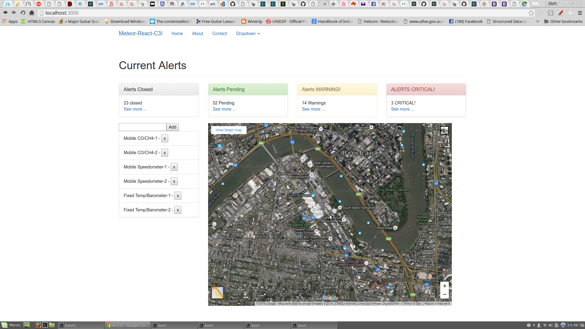

# mr-C3I COMMAND and CONTROL

### Mark Addinall - 2016
### Brisbane Australia
-----

This is one of several concurrent projects I am working on as part of my 2016 R&D.
Implementing the same application using a number of technology stacks.

- Modern, but still AJAX (AJaJ) RESTful client server systems
- Full stack Javascript systems using Angular
- Full stack Javascript systems using REact
- Full stack Javascript systems using custom components
- Python/Django - Bootstrap

This is my play on using the latest technologies to provide a flexible, robust and pleasing
UI(X), APIs and RESTFul transaction servers.

## Synopsis

This is an experimental system comprising 
- Asset management, 
- reporting, 
- tracking, 
- machine learning and 
- statistical process control over a distributed network.

I am writing this system using different technology elsewhere, but decided to
write this version concurrently 
N/Django and BOOTSTRAP.

It seemed a shame to leave PYTHON out of the mix.  The rechnology stack is a little
older than the full stack JS Frameworks; but if it works well, why not.

This is from Intelligent Aerospace, July 2016.

> ORBCOMM Inc. (Nasdaq:ORBC) is a global provider of Machine-to-Machine (M2M) communication solutions 
> and a commercial satellite network dedicated to M2M. ORBCOMM’s unique combination of global satellite, 
> cellular and dual-mode network connectivity, hardware, web reporting applications, and software is the 
> M2M industry’s most complete service offering. Our solutions are designed to remotely track, monitor, and 
> control fixed and mobile assets in core vertical markets including transportation & distribution, 
> heavy equipment, industrial fixed assets, oil & gas, maritime, mining and government. In addition, 
> ORBCOMM provides Automatic Identification System (AIS) data services for vessel tracking to improve 
> maritime safety to government and commercial customers worldwide.

------
# LEGAL Stuff

Copyright (c) 2016, Mark Addinall, That's IT, Brisbane Australia

*All rights reserved.*

Redistribution and use in source and binary forms, with or without
modification, are permitted provided that the following conditions are met:

    - Redistributions of source code must retain the above copyright
      notice, this list of conditions and the following disclaimer.

    - Redistributions in binary form must reproduce the above copyright
      notice, this list of conditions and the following disclaimer in the
      documentation and/or other materials provided with the distribution.

    - Neither the name of the That's IT nor the
      names of its contributors may be used to endorse or promote products
      derived from this software without specific prior written permission.

THIS SOFTWARE IS PROVIDED BY THE COPYRIGHT HOLDERS AND CONTRIBUTORS "AS IS" AND
ANY EXPRESS OR IMPLIED WARRANTIES, INCLUDING, BUT NOT LIMITED TO, THE IMPLIED
WARRANTIES OF MERCHANTABILITY AND FITNESS FOR A PARTICULAR PURPOSE ARE
DISCLAIMED. IN NO EVENT SHALL Mark Addinall (That's IT) BE LIABLE FOR ANY
DIRECT, INDIRECT, INCIDENTAL, SPECIAL, EXEMPLARY, OR CONSEQUENTIAL DAMAGES
(INCLUDING, BUT NOT LIMITED TO, PROCUREMENT OF SUBSTITUTE GOODS OR SERVICES;
LOSS OF USE, DATA, OR PROFITS; OR BUSINESS INTERRUPTION) HOWEVER CAUSED AND
ON ANY THEORY OF LIABILITY, WHETHER IN CONTRACT, STRICT LIABILITY, OR TORT
(INCLUDING NEGLIGENCE OR OTHERWISE) ARISING IN ANY WAY OUT OF THE USE OF THIS
SOFTWARE, EVEN IF ADVISED OF THE POSSIBILITY OF SUCH DAMAGE.

